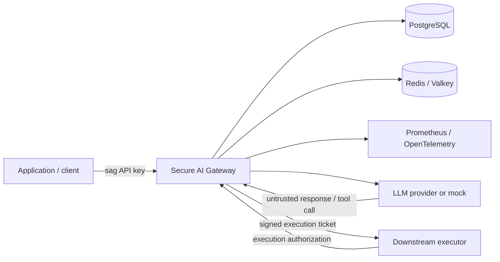
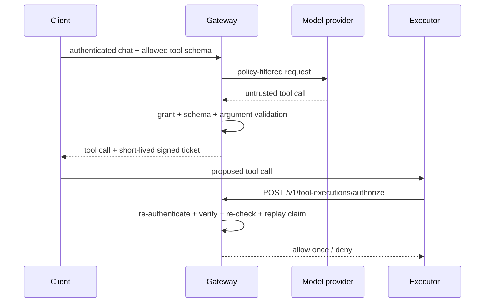

# Secure AI Gateway

Secure AI Gateway is a security-focused control plane and OpenAI-compatible
proxy for LLM applications. It centralizes authentication, authorization,
rate limiting, usage budgets, PII controls, prompt-injection controls, tool
exposure and execution authorization, audit logging, observability, and
security regression testing.

The core boundary is simple: model input and output are untrusted, policy
belongs outside the model, and security-critical state must remain
authoritative across replicas. The required development and verification path
runs without paid cloud infrastructure or paid model-provider calls.

## Stable release

The repository is preparing its first stable `v1.0.0` release. Package metadata
on the release-candidate branch is `1.0.0`; the stable Git tag is created only
after the final release checklist and immutable container evidence are complete.

Release criteria are documented in
[`docs/release-checklist.md`](docs/release-checklist.md). Release notes are in
[`docs/release-notes-v1.0.0.md`](docs/release-notes-v1.0.0.md).

## Capabilities

The gateway provides:

- gateway-issued high-entropy client API keys with one-way persisted digests;
- PostgreSQL-backed key creation, revocation, rotation, and usage accounting;
- distributed Redis/Valkey rate limiting and execution-ticket replay control;
- deployment-wide and per-client model authorization;
- structured and semantic PII detection with redact/deny policy;
- prompt-injection audit/deny policy with versioned regression benchmarks;
- least-privilege tool exposure and independent execution-time authorization;
- metadata-only JSON audit events, Prometheus metrics, and OpenTelemetry traces;
- fail-closed behavior for security-critical Redis/PostgreSQL state;
- hardened Docker and Kubernetes runtime configuration;
- enforced `restricted` Pod Security and default-deny NetworkPolicies;
- an optional private AWS/EKS/RDS/Valkey Terraform reference architecture;
- exact release dependencies, vulnerability analysis, SBOMs, and attestations;
- deterministic adversarial, concurrency, resilience, performance, kind,
  manifest, Terraform, preflight, and release verification in CI.

The gateway **does not execute external side-effecting tools**. Model-generated
tool calls are untrusted proposals. The gateway may issue a short-lived signed
ticket for a separate executor, which must independently obtain execution-time
authorization.

## Quick start

The deterministic local demo exercises the primary security path without a
real model provider:

```bash
make demo
```

A successful run ends with:

```text
secure_ai_gateway_demo=PASS
provider_calls=mock_only
billable_cloud_resources=0
```

Primary local verification:

```bash
make install
make style
make check
make lock-verify
make preflight
```

Controlled dependency failure injection:

```bash
make resilience
```

Two-replica Kubernetes verification:

```bash
make kind-up
make kind-verify
```

## Architecture



PostgreSQL is authoritative for client/key identity and persistent usage.
Redis/Valkey is authoritative for distributed rate-limit state and one-time
execution claims. Telemetry is deliberately not an authorization dependency.

See the reviewer-oriented
[`architecture guide`](docs/architecture.md) for the complete trust-boundary
review.

## Request processing

```text
authenticate client
  -> distributed rate limit
  -> model authorization
  -> PII inspection/redaction
  -> prompt-injection inspection
  -> persistent usage-budget check
  -> provider request
  -> required usage validation
  -> persistent usage record
  -> untrusted tool-call validation
  -> signed execution ticket, if applicable
```

Authentication establishes identity only. Model, rate, usage, PII,
prompt-injection, tool exposure, and execution remain separate authorization or
policy decisions.

## Tool execution authorization



Tickets bind client/key identity, source request, tool call, tool name, exact
arguments, authoritative schema, risk class, and expiry. Current policy is
re-checked at execution time, and Redis/Valkey atomically consumes the execution
ID once.

## Security controls

| Boundary | Control |
| --- | --- |
| Client identity | Structured gateway credentials; one-way digest persisted; constant-time comparison |
| Key lifecycle | PostgreSQL-backed creation, revocation, and atomic rotation |
| Model access | Deployment ceiling plus per-client exact grants |
| Request abuse | Bounded body, bounded server concurrency, distributed per-client RPM |
| Usage | Persistent per-client UTC-day token/cost budgets |
| Sensitive data | Structured and semantic PII redact/deny policy |
| Prompt injection | Deterministic off/audit/deny policy plus regression benchmark |
| Tool exposure | Per-client allowlist plus authoritative execution registry |
| Tool execution | Signed ticket, exact argument/schema binding, policy re-check, one-time claim |
| Audit/telemetry | Explicit metadata only; sensitive content excluded |
| Container | Non-root, read-only root, dropped capabilities, no-new-privileges |
| Kubernetes | Two replicas, probes, PDB, resources, restricted Pod Security, default deny |
| Supply chain | Exact lock, SHA pins, scanners, SBOMs, immutable GHCR tags, attestations |
| Repository | Whole-tree style gate and repository/history preflight |

See [`SECURITY.md`](SECURITY.md),
[`docs/security-review.md`](docs/security-review.md),
[`docs/kubernetes-security.md`](docs/kubernetes-security.md), and
[`docs/supply-chain.md`](docs/supply-chain.md).

## Verification

The primary CI workflow separates major failure domains into independent jobs:

```text
Pytest
Reproducible release install
M10 adversarial/reliability/performance
Security analysis
Prompt-injection benchmark
Semantic PII benchmark
Docker build
End-to-end demo
Resilience smoke
Kubernetes manifests
kind security and resilience
Terraform
```

Separate workflows provide project style enforcement, repository/history
preflight, CodeQL, Trivy container scanning, and public GHCR publication.

The live kind job enforces Pod Security and NetworkPolicy. It proves an
unauthorized Redis path is denied, verifies shared state across replicas,
deletes a replica under traffic, waits for its replacement, and performs
bounded load/resource checks.

The release workflow publishes an immutable SHA image, resolves its OCI digest,
generates an SPDX image SBOM, creates build-provenance and SBOM attestations,
and proves anonymous public pull. Tagged releases additionally verify that the
semver image resolves to the same digest and can also be pulled anonymously.

Reproducible evidence is mapped in
[`docs/portfolio-evidence.md`](docs/portfolio-evidence.md).

## Published security evaluation baselines

Prompt-injection curated regression baseline:

```text
TP=36  FP=7  TN=13  FN=10
precision=0.8372
recall=0.7826
false_positive_rate=0.3500
false_negative_rate=0.2174
```

Semantic PII curated regression baseline:

```text
TP=32  FP=0  TN=20  FN=0
precision=1.0000
recall=1.0000
false_positive_rate=0.0000
false_negative_rate=0.0000
```

These are small versioned regression corpora, not estimates of real-world
production accuracy. Accepted residual risks are documented in
[`docs/security-review.md`](docs/security-review.md).

## Local development

```bash
cp .env.example .env
cp config/security-policies.example.json config/security-policies.json
make install
```

Validate policy:

```bash
set -a
source .env
set +a
python -m app.policy_cli validate
```

Developer installation uses dependency ranges from `pyproject.toml`.
Release-style runtime installation uses the exact committed lock:

```bash
make release-install
```

Dependency maintenance is documented in
[`docs/dependency-policy.md`](docs/dependency-policy.md).

## Developer commands

```text
make install             install project + development/security tooling
make release-install     install exact runtime dependency lock
make lock-verify         validate release-lock invariants
make style               enforce whole-repository project style
make test                run pytest
make evals               enforce security evaluation baselines
make security            run Bandit + dependency audit
make check               style + test + evals + security
make demo                run zero-cost end-to-end demo
make resilience          inject dependency outages
make m10-adversarial     run deterministic adversarial coverage
make m10-integration     run Redis/PostgreSQL concurrency verification
make benchmark           run local reliability/performance baseline
make preflight           run repository/release hygiene checks
make up / make down      manage Docker Compose
make kind-up             build/start local kind environment
make kind-verify         verify Kubernetes policy/resilience/load
make terraform-validate  validate both Terraform roots
```

## Project style

The repository uses its own self-contained style standard rather than adopting
or vendoring an external guide or linter policy.

The hard line-length rule is 80 characters except for genuinely indivisible
content such as URLs or immutable machine identifiers. Python project functions
use the RMEIO contract:

- **Requires** -- preconditions;
- **Modifies** -- state/resources changed;
- **Effects** -- externally visible behavior;
- **Inputs** -- function inputs;
- **Outputs** -- returned or produced outputs.

`make style` checks the entire tracked project tree, and CI runs the same gate.
There is no legacy baseline, moving exemption, or grandfathered file set.

See [`docs/style-standard.md`](docs/style-standard.md).

## Kubernetes

Local kind uses two gateway replicas, PostgreSQL, Redis, Prometheus, and an
OpenTelemetry Collector. The namespace enforces the Kubernetes `restricted`
Pod Security profile. The local overlay starts from ingress/egress default deny
and permits only required application, database, cache, telemetry, monitoring,
discovery, and DNS paths.

The optional cloud overlay also starts default deny. Backend/AWS egress is
rendered from actual Terraform subnet CIDRs. Terraform enables EKS VPC CNI
NetworkPolicy support and a private Secrets Manager endpoint. Gateway and
migration use separate EKS Pod Identity roles.

The default cloud provider is `mock`, so unrestricted Internet/provider egress
is absent. A live-provider deployment must add environment-specific controlled
egress.

See [`docs/kubernetes.md`](docs/kubernetes.md) and
[`docs/kubernetes-security.md`](docs/kubernetes-security.md).

## Container release

The public release workflow publishes immutable commit images:

```text
ghcr.io/joshuabisdorf/secure-ai-gateway:sha-<commit>
```

A `v*` Git tag publishes the corresponding version alias. The OCI digest is the
artifact identity. Build provenance and the SPDX SBOM can be verified against
that digest as documented in
[`docs/supply-chain.md`](docs/supply-chain.md).

The release path does not require AWS credentials, Docker Hub credentials,
provider keys, or Terraform apply.

## Optional AWS reference architecture

Terraform defines protected S3/KMS remote state plus VPC networking, private
EKS, ECR, encrypted RDS PostgreSQL, TLS/IAM-authenticated ElastiCache Valkey,
KMS, Secrets Manager, a private Secrets Manager endpoint, EKS NetworkPolicy,
and separate Pod Identity roles for gateway runtime and migration.

The AWS deployment is reference-only for the required release path. Helpers that
can create paid AWS resources require explicit opt-in guards.

See [`docs/cost-policy.md`](docs/cost-policy.md),
[`docs/terraform.md`](docs/terraform.md), and
[`docs/cloud-deployment.md`](docs/cloud-deployment.md).

## Repository layout

```text
app/                 gateway/security implementation
config/              tracked policy examples and demo policy
db/migrations/       PostgreSQL migrations
docs/                architecture, security, operations, release evidence
evals/datasets/      versioned security regression corpora
k8s/                 base/local/CI/cloud/migration Kustomize targets
observability/       Prometheus and OpenTelemetry configuration
requirements/        exact release-runtime dependency lock
scripts/             verification, kind, release, optional AWS helpers
terraform/           bootstrap + AWS reference roots
tests/               unit/integration/adversarial tests
.github/workflows/   CI, security, style, preflight, release workflows
```

## License

Secure AI Gateway is licensed under the
[Apache License 2.0](LICENSE).

Copyright 2026 Joshua Bisdorf. Attribution information is in
[`NOTICE`](NOTICE). The project-owned style standard does not change the
project's license or attribution.
