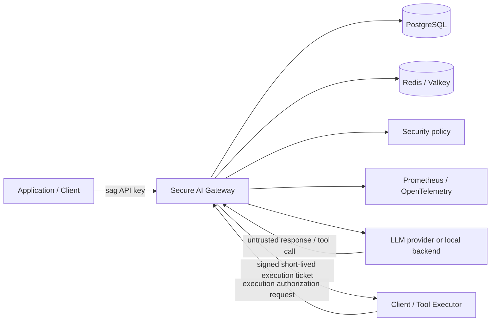
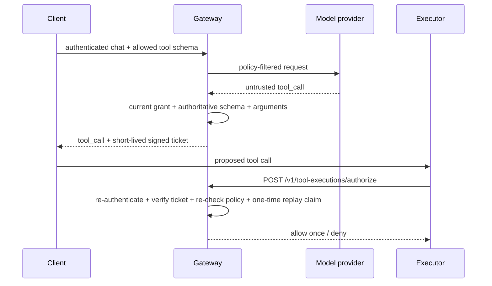

# Secure AI Gateway

Secure AI Gateway is a security-focused control plane and OpenAI-compatible proxy for LLM applications. It sits between an application and an LLM provider or local backend and centralizes authentication, authorization, rate limiting, usage budgets, PII controls, prompt-injection controls, tool exposure and execution authorization, audit logging, observability, and security regression testing.

I built the project around a simple security boundary: model input and output are untrusted, policy decisions belong outside the model, and security-critical state must remain authoritative across replicas. The default development and verification path is also designed to run without paid cloud infrastructure or paid model-provider requests.

## Summary

The gateway currently provides:

- gateway-issued client identities and high-entropy API keys, with only one-way digests persisted;
- PostgreSQL-backed key creation, revocation, rotation, and daily usage accounting;
- distributed Redis/Valkey rate limiting and execution-ticket replay protection;
- deployment-wide and per-client model authorization;
- structured and semantic PII detection with redact/deny policy;
- prompt-injection audit/deny policy with versioned regression benchmarks;
- least-privilege tool exposure and independent execution-time authorization;
- sensitive-data-minimized JSON audit events, Prometheus metrics, and OpenTelemetry traces;
- fail-closed runtime behavior when security-critical Redis/PostgreSQL state is unavailable;
- hardened Docker and Kubernetes runtime configuration with restricted Pod Security and overlay-aware default-deny NetworkPolicies;
- Terraform for an optional private AWS/EKS/RDS/Valkey architecture;
- an exact release-runtime dependency lock, SHA-pinned GitHub Actions, vulnerability/security analysis, image SBOM generation, and build/SBOM attestations;
- deterministic adversarial, concurrency, resilience, performance, kind, manifest, Terraform, preflight, and public-container verification in CI.

The gateway **does not execute external side-effecting tools**. A model-generated tool call is treated as untrusted output. The gateway validates the request and can issue a short-lived authorization ticket for a separate downstream executor.

## Quick start

The deterministic local demo exercises the primary security path without external model-provider calls:

```bash
make demo
```

It verifies authenticated chat, usage accounting, PII redaction, prompt-injection detection, signed tool-ticket issuance, execution-time authorization, replay denial, rate limiting, and Prometheus metrics. It does not print the raw client key or execution ticket and revokes the temporary client key on exit.

A successful run ends with:

```text
secure_ai_gateway_demo=PASS
provider_calls=mock_only
billable_cloud_resources=0
```

Primary local verification:

```bash
make install
make check
make lock-verify
```

Controlled dependency failure injection:

```bash
make resilience
```

Hardened two-replica Kubernetes verification:

```bash
make kind-up
make kind-verify
```

## Architecture



PostgreSQL is authoritative for client identity, key lifecycle, and persistent usage accounting. Redis/Valkey provides shared rate-limit state and one-time execution-ticket replay claims. Prometheus and OpenTelemetry expose operational state without making telemetry availability part of authorization.

See [`docs/architecture.md`](docs/architecture.md) for trust boundaries and deployment structure.

## Request processing

```text
authenticate client
  -> distributed rate limit
  -> model authorization
  -> PII inspection/redaction
  -> prompt-injection inspection
  -> persistent usage-budget check
  -> provider request
  -> persistent usage record
  -> untrusted tool-call validation
  -> signed execution ticket, if applicable
```

Security policy is enforced before provider access where possible, and state that affects authorization is checked against authoritative runtime data rather than trusted model text or prompt secrecy.

## Tool execution authorization

Tool execution is intentionally separated from tool proposal. A model may propose a tool call, but that proposal is not authority to perform a side effect.



Execution tickets bind client identity, source request, tool call, tool name, exact arguments, authoritative schema, risk class, and expiry. Authorization re-checks current policy at execution time and claims the execution ID once to prevent replay.

## Security controls

| Boundary | Control |
| --- | --- |
| Client identity | Structured `sag_<key_id>_<secret>` credentials; only SHA-256 digest persisted; constant-time verification |
| Key lifecycle | PostgreSQL-backed creation, revocation, and atomic rotation |
| Model access | Deployment ceiling plus per-client exact model grants |
| Request abuse | Bounded request body, Uvicorn concurrency/keep-alive limits, Redis/Valkey per-client RPM |
| Usage | Persistent per-client UTC-day token/cost budgets |
| Sensitive data | Structured and local semantic PII detection with redact/deny policy |
| Prompt injection | Deterministic audit/deny/off policy plus regression benchmark |
| Tool execution | Authoritative schema, exact argument hash, risk class, HMAC ticket, expiry, identity binding, current-policy recheck, one-time replay claim |
| Audit/telemetry | Metadata-only audit events and bounded labels; prompts, credentials, raw PII/tool arguments/results/tickets excluded |
| Container | Non-root, read-only root filesystem, dropped capabilities, no-new-privileges |
| Kubernetes | Two replicas, probes, PDB, resource bounds, `restricted` Pod Security enforcement, default-deny NetworkPolicies, explicit local/cloud egress paths |
| Supply chain | Exact release lock, direct-artifact hash pin, SHA-pinned Actions, Dependabot, Bandit, CodeQL, `pip-audit`, CycloneDX dependency SBOM, Trivy, immutable GHCR SHA tags, SPDX image SBOM and GitHub provenance/SBOM attestations |
| Repository hygiene | Release-critical file checks, tracked-secret/artifact checks, immutable Action-ref checks, optional full-history sensitive-filename scanning |

See [`SECURITY.md`](SECURITY.md), [`docs/security-review.md`](docs/security-review.md), [`docs/kubernetes-security.md`](docs/kubernetes-security.md), and [`docs/supply-chain.md`](docs/supply-chain.md).

## Verification

The primary CI workflow separates the major failure domains into independent jobs:

```text
Pytest
Reproducible release install
M10 adversarial/reliability/performance
Security analysis
Prompt-injection benchmark
Semantic PII benchmark
Docker build
End-to-end demo
Resilience smoke
Kubernetes manifests
kind security and resilience
Terraform
```

The clean release-install job installs `requirements/release.lock` into a new Python 3.13 virtual environment, installs the application without dependency resolution/build isolation, runs `pip check`, and imports the production server/model. The Docker build consumes the same exact runtime lock on Python 3.14.

The live kind job applies the enforcing namespace and NetworkPolicies, proves an unauthorized Redis path is blocked, verifies shared Redis/PostgreSQL state across gateway replicas, deletes a replica while exercising the survivor, waits for a replacement, and performs bounded concurrent load/resource checks.

Security analysis runs Bandit, `pip-audit`, and CycloneDX dependency-SBOM generation. Separate workflows provide CodeQL, Trivy container scanning, and repository preflight.

The release workflow publishes an immutable GHCR image, resolves its OCI digest, generates an SPDX image SBOM, creates GitHub build-provenance and SBOM attestations associated with the image, then logs out and verifies anonymous public pull. Verification commands are in [`docs/supply-chain.md`](docs/supply-chain.md).

Reproducible claims and supporting commands are mapped in [`docs/portfolio-evidence.md`](docs/portfolio-evidence.md).

## Security evaluation baselines

Prompt-injection curated regression baseline:

```text
TP=36  FP=7  TN=13  FN=10
precision=0.8372
recall=0.7826
false_positive_rate=0.3500
false_negative_rate=0.2174
```

Semantic PII curated regression baseline:

```text
TP=32  FP=0  TN=20  FN=0
precision=1.0000
recall=1.0000
false_positive_rate=0.0000
false_negative_rate=0.0000
```

These are small versioned regression corpora, not estimates of real-world production accuracy. Known residual risks are recorded in [`docs/security-review.md`](docs/security-review.md).

## Local development

```bash
cp .env.example .env
cp config/security-policies.example.json config/security-policies.json
make install
```

Validate policy:

```bash
set -a
source .env
set +a
python -m app.policy_cli validate
```

The ordinary developer installation keeps dependency ranges from `pyproject.toml`. Release-style runtime installation uses the exact committed lock:

```bash
make release-install
```

See [`docs/dependency-policy.md`](docs/dependency-policy.md) for lock refresh and dependency/base-image update policy.

## Developer commands

```text
make install             install project + development/security tooling
make release-install     install exact runtime dependency lock
make lock-verify         validate release-lock invariants
make test                run pytest
make evals               enforce prompt-injection and semantic-PII baselines
make security            Bandit + dependency audit
make check               test + evals + security
make demo                zero-cost end-to-end demo
make resilience          inject backend/telemetry outages and verify behavior
make m10-adversarial     deterministic adversarial regression corpus
make m10-integration     real Redis/PostgreSQL concurrency verification
make benchmark           local M10 reliability/performance baseline
make preflight           repository/release hygiene checks
make up / make down      Docker Compose lifecycle, preserving volumes
make kind-up             build/start local kind environment
make kind-verify         verify policy, rescheduling, shared state, and bounded load
make terraform-validate  side-effect-free Terraform validation
```

## Kubernetes

The local kind environment uses two gateway replicas, shared PostgreSQL and Redis, Prometheus, and an OpenTelemetry Collector. The namespace enforces the Kubernetes `restricted` Pod Security profile. The local overlay starts from ingress/egress default deny and permits only the application/database/cache/telemetry/discovery paths required by the stack.

The optional cloud overlay also starts default-deny. Its backend/AWS egress policy is rendered from actual Terraform private/data subnet CIDRs instead of committed placeholder identities. Terraform enables EKS VPC CNI NetworkPolicy support and creates a private Secrets Manager interface endpoint. Gateway and migration use separate EKS Pod Identity roles rather than ordinary Kubernetes API tokens.

The default cloud provider is `mock`, so unrestricted Internet/provider egress is intentionally absent. Live-provider deployments must add environment-specific controlled egress.

See [`docs/kubernetes.md`](docs/kubernetes.md) and [`docs/kubernetes-security.md`](docs/kubernetes-security.md).

## Container release

The public release workflow publishes immutable commit images:

```text
ghcr.io/joshuabisdorf/secure-ai-gateway:sha-<commit>
```

A `v*` Git tag also publishes the corresponding version tag. Consumers should resolve and record the immutable OCI digest. Build provenance and the SPDX SBOM can be verified against that digest with GitHub CLI as documented in [`docs/supply-chain.md`](docs/supply-chain.md).

The release path does not require AWS credentials, Docker Hub credentials, provider keys, or Terraform apply.

## Optional AWS reference architecture

Terraform defines protected S3/KMS remote state plus an application architecture with VPC networking, private EKS, ECR, encrypted RDS PostgreSQL, TLS/IAM-authenticated ElastiCache Valkey, KMS, Secrets Manager, a private Secrets Manager endpoint, EKS NetworkPolicy support, and separate Pod Identity roles for gateway runtime and migration.

The AWS deployment remains a reference architecture rather than a prerequisite for development or release verification. Helpers that can create paid AWS resources require explicit billable-AWS opt-in guards.

See [`docs/cost-policy.md`](docs/cost-policy.md), [`docs/terraform.md`](docs/terraform.md), and [`docs/cloud-deployment.md`](docs/cloud-deployment.md).

## Repository layout

```text
.
├── app/                         gateway/security implementation
├── config/                      tracked policy examples and demo policy
├── db/migrations/               PostgreSQL migrations
├── docs/                        architecture, security, operations, release evidence
├── evals/datasets/              versioned security regression corpora
├── k8s/                         base/local/CI/cloud/migration Kustomize targets
├── observability/               Prometheus and OTel configuration
├── requirements/                exact release-runtime dependency lock
├── scripts/                     verification, kind, release, and optional AWS helpers
├── terraform/                   bootstrap + AWS reference roots
├── tests/                       unit/integration/adversarial tests
├── .github/workflows/           CI, CodeQL, preflight, security, release workflows
├── CHANGELOG.md
├── CONTRIBUTING.md
├── LICENSE
├── NOTICE
├── Makefile
├── Dockerfile
├── compose.yaml
└── pyproject.toml
```

## Current release work

The core gateway and M10 adversarial/reliability/performance verification are implemented. M11 adds reproducible release dependencies, image SBOM/provenance evidence, restricted Pod Security enforcement, default-deny overlay-aware network policy, live kind rescheduling/load checks, and the cloud CIDR/runtime-identity model.

Before `v1.0.0`, the remaining roadmap work is the M12 final security/release review and deliberate stable tag. The tag will be created only after [`docs/release-checklist.md`](docs/release-checklist.md) is satisfied. Paid AWS runtime verification remains an explicit non-requirement.

## Documentation convention

Project functions use RME-style docstrings:

- **Requires** — conditions that must hold before execution
- **Modifies** — state/resources changed
- **Effects** — externally visible side effects
- **Inputs** — function inputs
- **Outputs** — returned or produced outputs

## License

Secure AI Gateway is licensed under the [Apache License 2.0](LICENSE).

Copyright 2026 Joshua Bisdorf. Attribution information is provided in [`NOTICE`](NOTICE). The Apache-2.0 license permits use, modification, and redistribution, including in commercial and closed-source systems, subject to its license and notice requirements.
