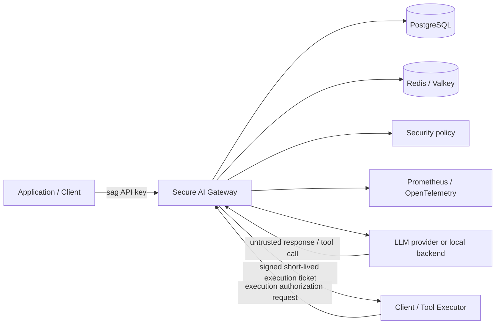
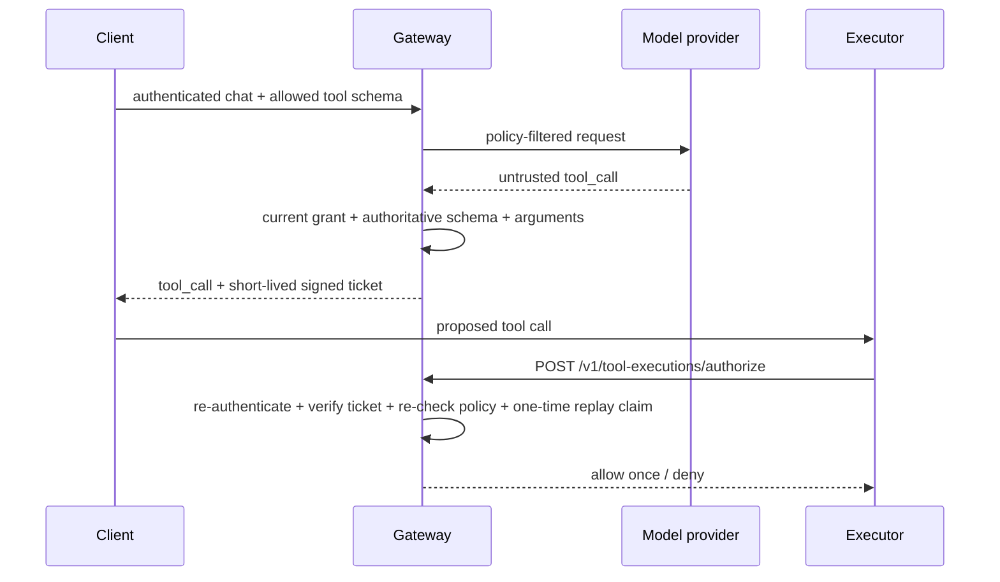

# Secure AI Gateway

Secure AI Gateway is a security-focused control plane and proxy for LLM applications. It sits between an application and an LLM provider/local backend and centralizes authentication, authorization, rate limiting, usage budgets, PII controls, prompt-injection controls, tool exposure and execution authorization, audit logging, observability, and security regression testing.

The project is built under a **zero-cost-by-default** constraint: the complete required development, verification, packaging, and portfolio path uses local tooling, the deterministic mock provider, public GitHub Actions/Packages, Docker, and kind. The AWS implementation is an optional reference architecture and does not need to be applied.

## What this project demonstrates

A reviewer can use this repository to inspect or verify:

- gateway-issued client identities and high-entropy API keys, with only hashes persisted;
- PostgreSQL-backed key revocation/rotation and daily usage accounting;
- distributed Redis/Valkey rate limiting and execution-ticket replay protection;
- deployment-wide and per-client model authorization;
- structured plus semantic PII detection with redact/deny policy;
- prompt-injection audit/deny policy with a versioned regression benchmark;
- least-privilege tool exposure and independent execution-time authorization;
- sensitive-data-minimized JSON audit events, Prometheus metrics, and OpenTelemetry traces;
- fail-closed runtime behavior when security-critical Redis/PostgreSQL state disappears;
- hardened Docker/Kubernetes runtime configuration;
- Terraform for an optional private AWS/EKS/RDS/Valkey design;
- CI security analysis, CodeQL, dependency audit/SBOM generation, benchmarks, clean end-to-end and resilience tests, manifest validation, Terraform validation, and public container delivery.

The gateway **does not execute external side-effecting tools**. A model-generated tool call is untrusted output; the gateway only issues and verifies authorization for a downstream executor.

## Five-minute reviewer path

For the fastest local demonstration:

```bash
make demo
```

The demo uses only the mock provider. It creates a temporary client, proves authenticated chat, usage accounting, PII redaction, prompt-injection detection, signed tool-ticket issuance, execution-time authorization, replay denial, rate limiting, and Prometheus metrics. It does not print the raw client key or execution ticket and revokes the temporary client key on exit.

A successful run ends with:

```text
secure_ai_gateway_demo=PASS
provider_calls=mock_only
billable_cloud_resources=0
```

The same command is continuously verified on a clean GitHub-hosted Ubuntu runner as the `End-to-end demo` CI gate.

See [`docs/demo.md`](docs/demo.md).

For the primary local quality gates:

```bash
make install
make check
```

For controlled dependency failure injection:

```bash
make resilience
```

For the full two-replica kind verification:

```bash
make kind-up
make kind-verify
```

## Architecture



The main request path is:

```text
authenticate client
  -> distributed rate limit
  -> model authorization
  -> PII inspection/redaction
  -> prompt-injection inspection
  -> persistent usage-budget check
  -> provider request
  -> persistent usage record
  -> untrusted tool-call validation
  -> signed execution ticket, if applicable
```

Tool execution is separately mediated:



## Security controls

| Boundary | Control |
| --- | --- |
| Client identity | Structured `sag_<key_id>_<secret>` credentials; only SHA-256 digest persisted; constant-time verification |
| Key lifecycle | PostgreSQL-backed creation, revocation, and atomic rotation |
| Model access | Deployment ceiling plus per-client exact model grants |
| Request abuse | Bounded request body, Uvicorn concurrency/keep-alive limits, Redis/Valkey per-client RPM |
| Usage | Persistent per-client UTC-day token/cost budgets |
| Sensitive data | Structured and local semantic PII detection with redact/deny policy |
| Prompt injection | Deterministic audit/deny/off policy plus regression benchmark |
| Tool exposure | Per-client tool allowlist |
| Tool execution | Authoritative schema, exact argument hash, risk class, HMAC ticket, expiry, identity binding, current-policy recheck, one-time replay claim |
| Audit/telemetry | Metadata-only audit events and bounded labels; prompts, credentials, raw PII/tool arguments/results/tickets excluded |
| HTTP runtime | API docs hidden by default; no-store/CSP/referrer/MIME/frame headers; server banner and proxy headers disabled in container default |
| Container | Non-root, read-only root filesystem, dropped capabilities, no-new-privileges |
| Kubernetes | Two replicas, readiness/liveness/startup checks, PDB, resource bounds, `RuntimeDefault` seccomp, no privilege escalation |
| Supply chain | SHA-pinned Actions, Dependabot for Python/Actions/Docker, Bandit, CodeQL, `pip-audit`, CycloneDX dependency SBOM generation, immutable GHCR SHA tags |

See [`SECURITY.md`](SECURITY.md), [`docs/production-hardening.md`](docs/production-hardening.md), [`docs/security-review.md`](docs/security-review.md), and the [`docs/adr/`](docs/adr/) decision records.

## Current verification status

The main CI workflow currently has nine independent gates:

```text
Pytest
Security analysis
Prompt-injection benchmark
Semantic PII benchmark
Docker build
End-to-end demo
Resilience smoke
Kubernetes manifests
Terraform
```

Security analysis runs Bandit, audits installed Python dependencies with `pip-audit`, and generates/parses a CycloneDX JSON dependency SBOM. Third-party GitHub Actions are pinned to immutable commit SHAs.

`End-to-end demo` runs `make demo` on a fresh GitHub-hosted Ubuntu runner and proves the zero-cost mock-provider security path before cleaning up the Compose stack.

`Resilience smoke` stops and restores Redis and PostgreSQL to prove security-critical shared state fails closed, then stops the OpenTelemetry Collector to prove telemetry export is not an authorization dependency. See [`docs/reliability.md`](docs/reliability.md).

A separate SHA-pinned CodeQL workflow analyzes Python with the `security-extended` query suite and uploads code-scanning results for the public repository.

The separate `Release container` workflow builds and smoke-tests an immutable GHCR image, publishes it, logs out of GHCR, pulls the image anonymously, and smoke-tests the public image again.

## Security evaluation baselines

Prompt-injection curated regression baseline:

```text
TP=36  FP=7  TN=13  FN=10
precision=0.8372
recall=0.7826
false_positive_rate=0.3500
false_negative_rate=0.2174
```

Semantic PII curated regression baseline:

```text
TP=32  FP=0  TN=20  FN=0
precision=1.0000
recall=1.0000
false_positive_rate=0.0000
false_negative_rate=0.0000
```

These are small versioned regression corpora, not estimates of real-world production accuracy. Known residual risks are recorded in [`docs/security-review.md`](docs/security-review.md).

## Local development

Create ignored local configuration when you want to run the normal configurable stack instead of the self-contained demo:

```bash
cp .env.example .env
cp config/security-policies.example.json config/security-policies.json
```

Validate policy:

```bash
set -a
source .env
set +a
python -m app.policy_cli validate
```

Start/stop Docker Compose without deleting persistent data:

```bash
make up
make down
```

Do not use `docker compose down -v` unless you intentionally want to delete PostgreSQL, Redis, and Prometheus data.

## Developer commands

```text
make install             install project + development/security tooling
make test                run pytest
make evals               enforce prompt-injection and semantic-PII baselines
make security            Bandit + dependency audit
make check               test + evals + security
make demo                zero-cost end-to-end demo
make resilience          inject backend/telemetry outages and verify behavior
make up / make down      Docker Compose lifecycle, preserving volumes
make kind-up             build/start local kind environment
make kind-verify         verify two-replica kind security state
make terraform-validate  side-effect-free Terraform validation
```

Contribution/security-development guidance is in [`CONTRIBUTING.md`](CONTRIBUTING.md).

## Kubernetes

The free authoritative distributed-runtime verification uses kind. It runs two gateway replicas with shared PostgreSQL and Redis, local Prometheus, and an OpenTelemetry Collector.

```bash
make kind-up
make kind-verify
```

The verification sends traffic to different gateway pods and verifies shared Redis rate state, shared PostgreSQL usage, tracing, and two healthy Prometheus targets.

The Kubernetes namespace is configured to warn/audit against the restricted Pod Security profile. Environment-specific NetworkPolicies are intentionally not hard-coded into the shared base because local and optional cloud backends have different network identities; production operators should add policies once concrete service/CIDR identities are known.

See [`docs/kubernetes.md`](docs/kubernetes.md).

## Zero-cost public container release

The release workflow publishes:

```text
ghcr.io/joshuabisdorf/secure-ai-gateway:sha-<commit>
```

A `v*` Git tag also publishes the corresponding version tag. No AWS credentials, Docker Hub credentials, provider keys, or Terraform apply are involved.

## Optional AWS reference architecture

Terraform defines protected S3/KMS remote state plus an application architecture with VPC networking, private EKS, ECR, encrypted RDS PostgreSQL, TLS/IAM-authenticated ElastiCache Valkey, KMS, Secrets Manager, and separate Pod Identity roles for gateway runtime and migration.

This architecture is **reference-only for the required project path**. It may remain unapplied indefinitely. Any repository deployment helper that can create paid AWS resources requires explicit billable-AWS opt-in guards.

See [`docs/cost-policy.md`](docs/cost-policy.md), [`docs/terraform.md`](docs/terraform.md), and [`docs/cloud-deployment.md`](docs/cloud-deployment.md).

## Repository layout

```text
.
├── app/                         gateway/security implementation
├── config/                      tracked policy examples and demo policy
├── db/migrations/               PostgreSQL migrations
├── docs/                        design, ADRs, operations, demo, reliability, hardening
├── evals/datasets/              versioned security regression corpora
├── k8s/                         base/local/CI/cloud/migration Kustomize targets
├── observability/               Prometheus and OTel configuration
├── scripts/                     demo, resilience, kind, and optional AWS helpers
├── terraform/                   bootstrap + AWS reference roots
├── tests/                       unit/integration/adversarial tests
├── .github/workflows/           CI, CodeQL, and public container release
├── CHANGELOG.md
├── CONTRIBUTING.md
├── Makefile
├── Dockerfile
├── compose.yaml
└── pyproject.toml
```

## Roadmap

### Completed foundation and maturation

- [x] FastAPI/OpenAI-compatible gateway and provider abstraction
- [x] PostgreSQL client/key identity, revocation, and rotation
- [x] model authorization, distributed rate limiting, and persistent usage budgets
- [x] structured/semantic PII controls
- [x] prompt-injection detection and security evaluations
- [x] least-privilege tool exposure and execution-time authorization
- [x] audit logging, Prometheus, and OpenTelemetry
- [x] Docker and two-replica Kubernetes/kind verification
- [x] Terraform AWS reference architecture
- [x] zero-cost public GHCR release path
- [x] production/adversarial hardening
- [x] security/dependency analysis, SBOM generation, CodeQL, and automated dependency maintenance
- [x] clean-run portfolio demo verification in CI
- [x] Redis/PostgreSQL/telemetry failure-injection verification in CI
- [x] reviewer-focused documentation, final security review, release checklist, and ADRs

### Remaining before `v1.0.0`

- [ ] optionally run `make demo`, `make resilience`, and `make check` once more on the final release commit locally
- [ ] deliberately select a software license, or explicitly choose to remain unlicensed
- [ ] create the `v1.0.0` tag only after [`docs/release-checklist.md`](docs/release-checklist.md) is satisfied

Paid AWS runtime verification is explicitly not a release requirement.

## Documentation convention

Project functions use RME-style docstrings:

- **Requires** — conditions that must hold before execution
- **Modifies** — state/resources changed
- **Effects** — externally visible side effects
- **Inputs** — function inputs
- **Outputs** — returned or produced outputs

## License

No software license has been selected yet. That is intentionally left as an explicit owner decision before `v1.0.0` rather than silently choosing legal terms during implementation.
