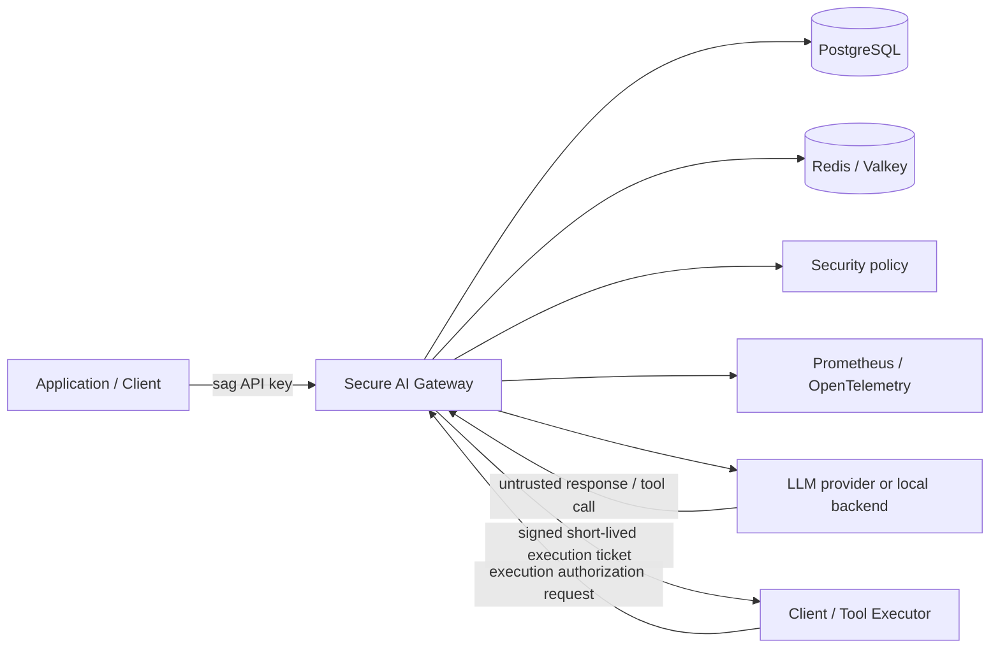
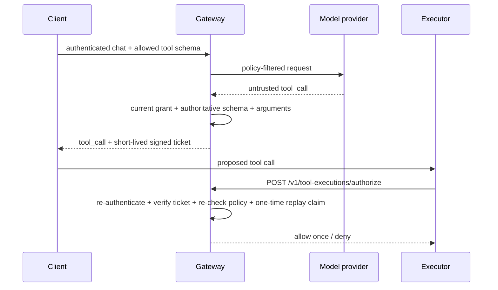

# Secure AI Gateway

Secure AI Gateway is a security-focused control plane and OpenAI-compatible proxy for LLM applications. It sits between an application and an LLM provider or local backend and centralizes authentication, authorization, rate limiting, usage budgets, PII controls, prompt-injection controls, tool exposure and execution authorization, audit logging, observability, and security regression testing.

I built the project around a simple security boundary: model input and output are untrusted, policy decisions belong outside the model, and security-critical state must remain authoritative across replicas. The default development and verification path is also designed to run without paid cloud infrastructure or paid model-provider requests.

## Summary

The gateway currently provides:

- gateway-issued client identities and high-entropy API keys, with only one-way digests persisted;
- PostgreSQL-backed key creation, revocation, rotation, and daily usage accounting;
- distributed Redis/Valkey rate limiting and execution-ticket replay protection;
- deployment-wide and per-client model authorization;
- structured and semantic PII detection with redact/deny policy;
- prompt-injection audit/deny policy with versioned regression benchmarks;
- least-privilege tool exposure and independent execution-time authorization;
- sensitive-data-minimized JSON audit events, Prometheus metrics, and OpenTelemetry traces;
- fail-closed runtime behavior when security-critical Redis/PostgreSQL state is unavailable;
- hardened Docker and Kubernetes runtime configuration;
- Terraform for an optional private AWS/EKS/RDS/Valkey architecture;
- CI security analysis, CodeQL, dependency auditing, SBOM generation, benchmarks, end-to-end and resilience tests, manifest validation, Terraform validation, repository preflight checks, and public container delivery.

The gateway **does not execute external side-effecting tools**. A model-generated tool call is treated as untrusted output. The gateway validates the request and can issue a short-lived authorization ticket for a separate downstream executor.

## Quick start

The deterministic local demo exercises the primary security path without external model-provider calls:

```bash
make demo
```

The demo creates a temporary client and verifies authenticated chat, usage accounting, PII redaction, prompt-injection detection, signed tool-ticket issuance, execution-time authorization, replay denial, rate limiting, and Prometheus metrics. It does not print the raw client key or execution ticket and revokes the temporary client key on exit.

A successful run ends with:

```text
secure_ai_gateway_demo=PASS
provider_calls=mock_only
billable_cloud_resources=0
```

The same command runs in CI on a clean GitHub-hosted Ubuntu runner.

See [`docs/demo.md`](docs/demo.md) for the full demo path.

Primary local verification:

```bash
make install
make check
```

Controlled dependency failure injection:

```bash
make resilience
```

Two-replica Kubernetes verification:

```bash
make kind-up
make kind-verify
```

## Architecture



PostgreSQL is the authoritative store for client identity, key lifecycle, and persistent usage accounting. Redis/Valkey provides shared rate-limit state and one-time execution-ticket replay claims. Prometheus and OpenTelemetry expose operational state without making telemetry availability part of authorization.

A more detailed trust-boundary and deployment view is in [`docs/architecture.md`](docs/architecture.md).

## Request processing

The main request path is:

```text
authenticate client
  -> distributed rate limit
  -> model authorization
  -> PII inspection/redaction
  -> prompt-injection inspection
  -> persistent usage-budget check
  -> provider request
  -> persistent usage record
  -> untrusted tool-call validation
  -> signed execution ticket, if applicable
```

Security policy is enforced before provider access where possible, and state that affects authorization is checked against authoritative runtime data rather than trusted model text or prompt secrecy.

## Tool execution authorization

Tool execution is intentionally separated from tool proposal. A model may propose a tool call, but that proposal is not authority to perform a side effect.



Execution tickets bind the client identity, source request, tool call, tool name, exact arguments, authoritative schema, risk class, and expiry. Authorization re-checks current policy at execution time and claims the execution ID once to prevent replay.

## Security controls

| Boundary | Control |
| --- | --- |
| Client identity | Structured `sag_<key_id>_<secret>` credentials; only SHA-256 digest persisted; constant-time verification |
| Key lifecycle | PostgreSQL-backed creation, revocation, and atomic rotation |
| Model access | Deployment ceiling plus per-client exact model grants |
| Request abuse | Bounded request body, Uvicorn concurrency/keep-alive limits, Redis/Valkey per-client RPM |
| Usage | Persistent per-client UTC-day token/cost budgets |
| Sensitive data | Structured and local semantic PII detection with redact/deny policy |
| Prompt injection | Deterministic audit/deny/off policy plus regression benchmark |
| Tool exposure | Per-client tool allowlist |
| Tool execution | Authoritative schema, exact argument hash, risk class, HMAC ticket, expiry, identity binding, current-policy recheck, one-time replay claim |
| Audit/telemetry | Metadata-only audit events and bounded labels; prompts, credentials, raw PII/tool arguments/results/tickets excluded |
| HTTP runtime | API docs hidden by default; no-store/CSP/referrer/MIME/frame headers; server banner and proxy headers disabled in container default |
| Container | Non-root, read-only root filesystem, dropped capabilities, no-new-privileges |
| Kubernetes | Two replicas, readiness/liveness/startup checks, PDB, resource bounds, `RuntimeDefault` seccomp, no privilege escalation |
| Supply chain | SHA-pinned Actions, Dependabot for Python/Actions/Docker, Bandit, CodeQL, `pip-audit`, CycloneDX dependency SBOM generation, immutable GHCR SHA tags |
| Repository hygiene | Release-critical file checks, tracked-secret/artifact checks, immutable Action-ref checks, and optional full-history sensitive-filename scanning |

See [`SECURITY.md`](SECURITY.md), [`docs/production-hardening.md`](docs/production-hardening.md), [`docs/security-review.md`](docs/security-review.md), and the [`docs/adr/`](docs/adr/) decision records.

## Verification

The main CI workflow has nine independent gates:

```text
Pytest
Security analysis
Prompt-injection benchmark
Semantic PII benchmark
Docker build
End-to-end demo
Resilience smoke
Kubernetes manifests
Terraform
```

Security analysis runs Bandit, audits installed Python dependencies with `pip-audit`, and generates/parses a CycloneDX JSON dependency SBOM. Third-party GitHub Actions are pinned to immutable commit SHAs.

`End-to-end demo` runs `make demo` on a fresh GitHub-hosted Ubuntu runner and validates the mock-provider security path before cleaning up the Compose stack.

`Resilience smoke` stops and restores Redis and PostgreSQL to verify fail-closed behavior for security-critical shared state, then stops the OpenTelemetry Collector to verify that telemetry export is not an authorization dependency. See [`docs/reliability.md`](docs/reliability.md).

A separate CodeQL workflow analyzes Python with the `security-extended` query suite. Container security scanning uses Trivy. Repository preflight runs independently and can scan full Git history for sensitive-looking filenames.

The `Release container` workflow builds and smoke-tests an immutable GHCR image, publishes it, logs out of GHCR, pulls the image anonymously, and smoke-tests the public image again.

Reproducible verification commands and supporting evidence are collected in [`docs/portfolio-evidence.md`](docs/portfolio-evidence.md).

## Security evaluation baselines

Prompt-injection curated regression baseline:

```text
TP=36  FP=7  TN=13  FN=10
precision=0.8372
recall=0.7826
false_positive_rate=0.3500
false_negative_rate=0.2174
```

Semantic PII curated regression baseline:

```text
TP=32  FP=0  TN=20  FN=0
precision=1.0000
recall=1.0000
false_positive_rate=0.0000
false_negative_rate=0.0000
```

These are small versioned regression corpora, not estimates of real-world production accuracy. Known residual risks are recorded in [`docs/security-review.md`](docs/security-review.md).

## Local development

Create ignored local configuration for the normal configurable stack:

```bash
cp .env.example .env
cp config/security-policies.example.json config/security-policies.json
```

Validate policy:

```bash
set -a
source .env
set +a
python -m app.policy_cli validate
```

Start or stop Docker Compose without deleting persistent data:

```bash
make up
make down
```

Do not use `docker compose down -v` unless PostgreSQL, Redis, and Prometheus data should be deleted intentionally.

## Developer commands

```text
make install             install project + development/security tooling
make test                run pytest
make evals               enforce prompt-injection and semantic-PII baselines
make security            Bandit + dependency audit
make check               test + evals + security
make demo                zero-cost end-to-end demo
make resilience          inject backend/telemetry outages and verify behavior
make preflight           repository/release hygiene checks
make up / make down      Docker Compose lifecycle, preserving volumes
make kind-up             build/start local kind environment
make kind-verify         verify two-replica kind security state
make terraform-validate  side-effect-free Terraform validation
```

Contribution and security-development guidance is in [`CONTRIBUTING.md`](CONTRIBUTING.md).

## Kubernetes

The local distributed-runtime environment uses kind with two gateway replicas, shared PostgreSQL and Redis, Prometheus, and an OpenTelemetry Collector.

```bash
make kind-up
make kind-verify
```

Verification sends traffic to different gateway pods and checks shared Redis rate state, shared PostgreSQL usage, tracing, and two healthy Prometheus targets.

The Kubernetes namespace is configured to warn/audit against the restricted Pod Security profile. Environment-specific NetworkPolicies are not hard-coded into the shared base because local and optional cloud backends have different network identities; production deployments should add policies once concrete service and egress identities are known.

See [`docs/kubernetes.md`](docs/kubernetes.md).

## Container release

The public release workflow publishes immutable images using the commit SHA:

```text
ghcr.io/joshuabisdorf/secure-ai-gateway:sha-<commit>
```

A `v*` Git tag also publishes the corresponding version tag. The release path does not require AWS credentials, Docker Hub credentials, provider keys, or Terraform apply.

## Optional AWS reference architecture

Terraform defines protected S3/KMS remote state plus an application architecture with VPC networking, private EKS, ECR, encrypted RDS PostgreSQL, TLS/IAM-authenticated ElastiCache Valkey, KMS, Secrets Manager, and separate Pod Identity roles for gateway runtime and migration.

I keep the AWS deployment as a reference architecture rather than a prerequisite for developing or verifying the gateway. Any repository helper that can create paid AWS resources requires an explicit billable-AWS opt-in guard.

See [`docs/cost-policy.md`](docs/cost-policy.md), [`docs/terraform.md`](docs/terraform.md), and [`docs/cloud-deployment.md`](docs/cloud-deployment.md).

## Repository layout

```text
.
├── app/                         gateway/security implementation
├── config/                      tracked policy examples and demo policy
├── db/migrations/               PostgreSQL migrations
├── docs/                        design, ADRs, operations, demo, reliability, hardening
├── evals/datasets/              versioned security regression corpora
├── k8s/                         base/local/CI/cloud/migration Kustomize targets
├── observability/               Prometheus and OTel configuration
├── scripts/                     demo, resilience, kind, and optional AWS helpers
├── terraform/                   bootstrap + AWS reference roots
├── tests/                       unit/integration/adversarial tests
├── .github/workflows/           CI, CodeQL, preflight, security, and release workflows
├── CHANGELOG.md
├── CONTRIBUTING.md
├── LICENSE
├── NOTICE
├── Makefile
├── Dockerfile
├── compose.yaml
└── pyproject.toml
```

## Current release work

The core gateway, security controls, deterministic demo, resilience verification, local distributed deployment, optional AWS architecture, CI security analysis, SBOM generation, CodeQL, container scanning, and public GHCR release path are implemented.

Before `v1.0.0`, the remaining work is focused on deeper adversarial and concurrency testing, reliability and performance baselines, supply-chain/release provenance, environment-aware Kubernetes network hardening, and the final release review. The stable tag will be created only after [`docs/release-checklist.md`](docs/release-checklist.md) is satisfied.

Paid AWS runtime verification is not a release requirement.

## Documentation convention

Project functions use RME-style docstrings:

- **Requires** — conditions that must hold before execution
- **Modifies** — state/resources changed
- **Effects** — externally visible side effects
- **Inputs** — function inputs
- **Outputs** — returned or produced outputs

## License

Secure AI Gateway is licensed under the [Apache License 2.0](LICENSE).

Copyright 2026 Joshua Bisdorf. Attribution information is provided in [`NOTICE`](NOTICE). The Apache-2.0 license permits use, modification, and redistribution, including in commercial and closed-source systems, subject to its license and notice requirements.
