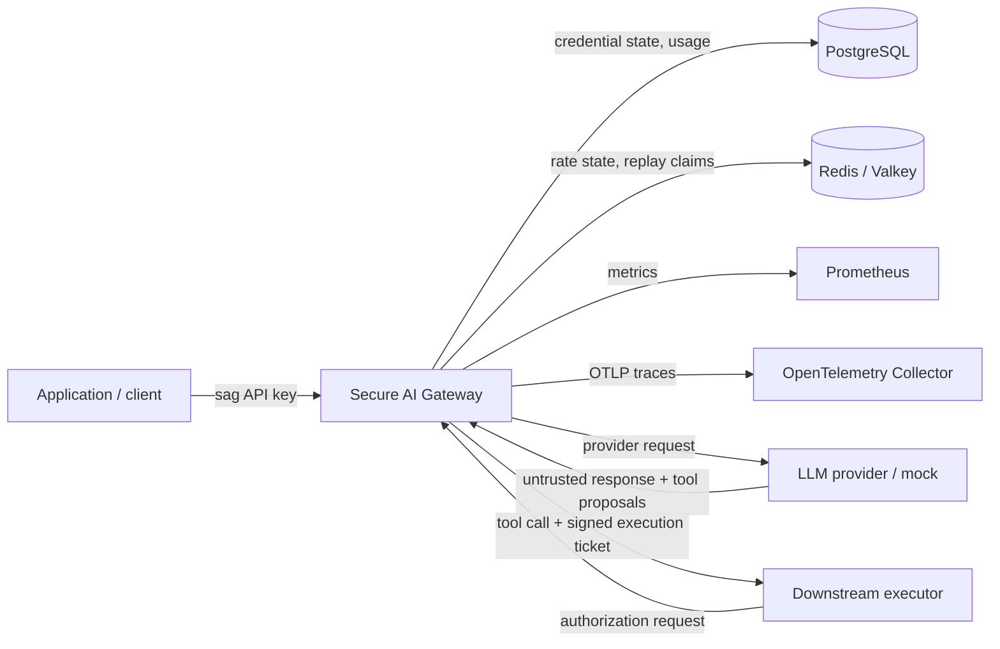
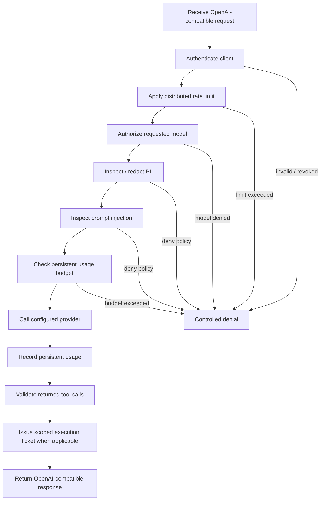
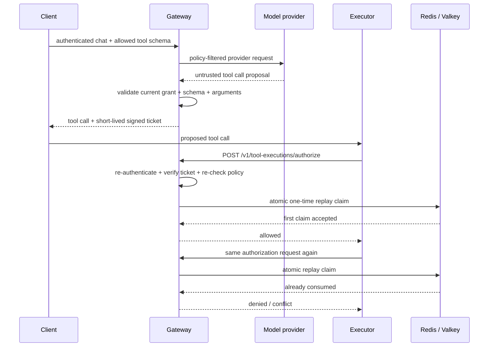

# Architecture

This page is the reviewer-oriented map of Secure AI Gateway. It complements the implementation-focused documents in `docs/` and the security invariants in `SECURITY.md`.

## System context

The gateway is the policy enforcement boundary. Model output is data, not authority. The gateway does not execute side-effecting external tools; it authorizes a downstream executor after re-authentication and execution-time policy checks.

## Request path

Security-critical shared-state dependencies are intentionally fail-closed. Redis loss prevents distributed authorization state from being trusted; PostgreSQL loss prevents durable client/usage state from being trusted. Telemetry export is not an authorization dependency.

## Execution authorization

The execution ticket binds the proposal to the client, tool, authoritative schema/arguments, risk class, expiry, and current policy state. See `docs/tool-execution-authorization.md` and `docs/adr/0001-execution-time-tool-authorization.md` for the detailed design.

## Trust boundaries

| Boundary | Attacker-controlled input | Primary controls |
| --- | --- | --- |
| Client → gateway | HTTP body, headers, model/tool selection | bounded body, authentication, model policy, schema validation, rate limits |
| Prompt → provider | user/system text | PII controls, injection controls, policy-filtered request |
| Provider → gateway | model text, token usage, tool proposals | response normalization, tool validation, output treated as untrusted |
| Executor → gateway | execution ticket + proposed tool call | re-authentication, signature/expiry binding, current-policy recheck, replay claim |
| Gateway → shared state | identity, usage, rate/replay state | PostgreSQL durability, Redis atomic state, fail-closed dependency handling |
| Gateway → telemetry | bounded metadata | prompts, credentials, raw PII, tool arguments/results, and tickets excluded |

## Deployment views

The zero-cost verified path uses Docker Compose locally and a two-replica kind deployment for distributed-runtime verification. Kubernetes applies non-root execution, read-only root filesystems, dropped Linux capabilities, `RuntimeDefault` seccomp, resource bounds, probes, rolling-update constraints, and a PodDisruptionBudget.

The AWS Terraform tree is a reference architecture rather than a required runtime path. It is deliberately separated from the no-cost verification path and guarded against accidental billable apply operations.
