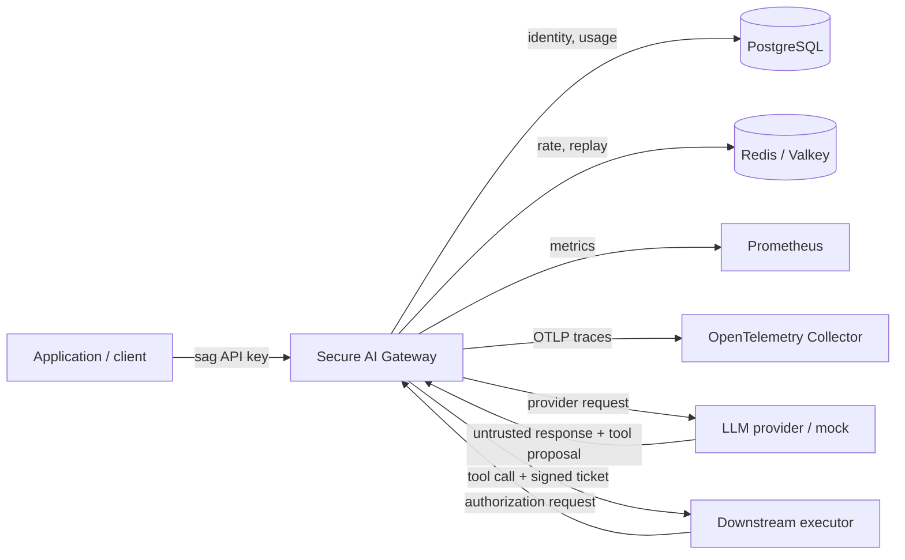
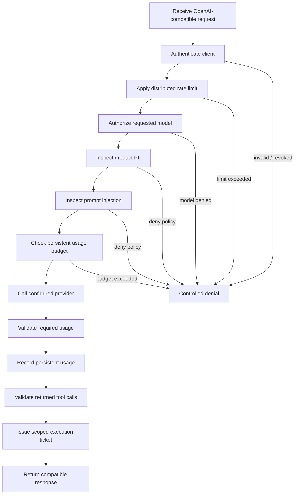
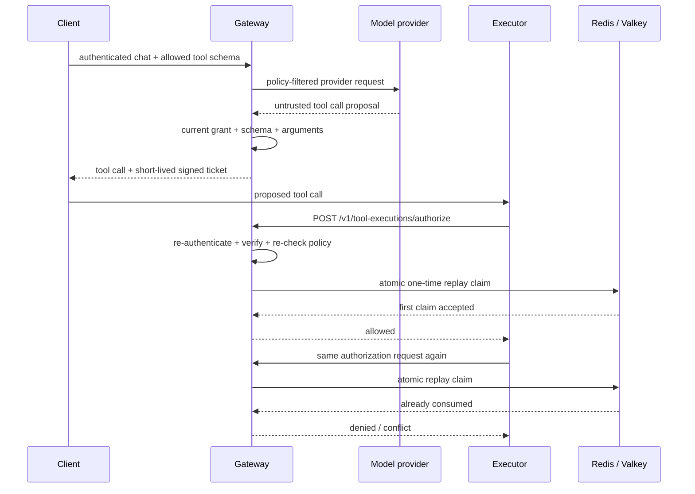

# Architecture

This page is the reviewer-oriented map of Secure AI Gateway. It complements
implementation-focused documents in `docs/` and the security invariants in
`SECURITY.md`.

## System context

The gateway is the policy-enforcement boundary. Model input and output are
untrusted. The gateway does not execute external side-effecting tools. It
authorizes a separate executor only after independent execution-time checks.

## Request path

Security-critical shared state fails closed. Redis loss prevents distributed
rate/replay state from being trusted. PostgreSQL loss prevents durable
identity/usage state from being trusted. Telemetry export is intentionally not
an authorization dependency.

## Authentication and authorization

Authentication resolves a presented gateway key to an active `client_id` and
`key_id`. The raw key is hashed before comparison; PostgreSQL stores only the
digest.

Authorization is separate from authentication. An authenticated request still
passes model, rate, PII, prompt-injection, usage, and tool-exposure policy. A
tool proposal receives a ticket only after authoritative schema and argument
validation. Execution authorization then re-authenticates and re-checks policy.

## Execution authorization

The execution ticket binds the proposal to client/key identity, source request,
tool-call ID, tool name, exact argument bytes, authoritative schema, risk class,
expiry, and current policy expectations. See
`docs/tool-execution-authorization.md` and ADR 0001 for the detailed design.

## Trust boundaries

| Boundary | Untrusted input | Primary controls |
| --- | --- | --- |
| Client -> gateway | HTTP framing, headers, JSON, model/tool selection | body bound, authentication, policy, validation, rate limits |
| Gateway -> provider | user/system content after policy | PII controls, injection controls, model/tool filtering |
| Provider -> gateway | text, usage, model/tool proposals | normalization, usage checks, schema/argument validation |
| Executor -> gateway | ticket and proposed tool call | re-authentication, canonical ticket verification, policy re-check, replay claim |
| Gateway -> PostgreSQL | client/key and usage state | restricted credentials, transactions, bounded pool waits |
| Gateway -> Redis | rate and replay state | atomic operations, fail-closed dependency handling |
| Gateway -> telemetry | bounded metadata | explicit field/label sets; sensitive content excluded |
| Pod -> cluster/network | runtime traffic and identities | restricted Pod Security, default deny, explicit allow paths |
| CI -> GHCR | release artifact | scoped token, immutable tag, digest, SBOM/provenance attestations |

## Secret boundaries

The gateway has no client-controlled provider credentials. Runtime secrets are
supplied by ignored local configuration or deployment-specific secret stores.

The primary secret classes are gateway client keys, provider keys, the
tool-signing key, database/cache credentials, short-lived cloud identity
material, and the ephemeral GitHub Actions release token.

Local client-key management writes a newly generated raw key only to an explicit
exclusive `0600` file. Database state retains the public key ID and digest, not
the raw key.

Local kind creates its runtime Kubernetes Secret from ignored local
configuration. The cloud overlay instead uses separate EKS Pod Identity roles
and AWS Secrets Manager. No cloud runtime Kubernetes Secret object is committed.

## Local deployment

The required zero-cost runtime path uses Docker Compose and a two-replica kind
deployment with PostgreSQL, Redis, Prometheus, and an OpenTelemetry Collector.

The Kubernetes namespace enforces the `restricted` Pod Security profile. The
gateway runs non-root with a read-only root filesystem, dropped capabilities,
`RuntimeDefault` seccomp, probes, a PodDisruptionBudget, rolling-update
constraints, and resource requests/limits.

The local network policy starts from namespace-wide ingress/egress default deny.
It allows only the gateway, PostgreSQL, Redis, telemetry, monitoring,
Kubernetes-discovery, and DNS paths required by the verified stack.

## AWS reference deployment

The AWS Terraform tree is an optional reference architecture, not a required
runtime path. It is statically validated without creating billable resources.

RDS PostgreSQL and ElastiCache Valkey use isolated data-subnet identities.
Backend egress policies are generated from Terraform subnet CIDRs at deployment
time. A private Secrets Manager endpoint avoids unrestricted Internet egress for
runtime secret retrieval.

Gateway and migration use separate EKS Pod Identity roles. The cloud overlay
starts from default-deny NetworkPolicy. Live provider egress is deliberately
absent until an operator adds a deployment-specific controlled path.

## Release and supply-chain path

The stable release path is also zero-cost. GitHub Actions builds from the exact
runtime dependency lock, smoke-tests the container, pushes an immutable
`sha-<commit>` image, resolves its OCI digest, generates an SPDX image SBOM, and
creates build-provenance and SBOM attestations.

A `v*` tag publishes an additional version alias for the same reviewed image.
Consumers should resolve and retain the digest rather than relying on mutable
tag names as artifact identity.

## Verification map

The architecture is exercised by several independent evidence paths:

- `make demo` covers the primary authenticated security flow;
- `make resilience` covers required-backend failure behavior;
- M10 tests cover malformed input, races, stale policy, and failure injection;
- `make benchmark` records local two-replica performance evidence;
- `make kind-verify` covers Pod Security, NetworkPolicy, shared state,
  rescheduling, and bounded load;
- Terraform validation covers the optional AWS reference configuration;
- release CI covers exact dependencies, scanning, image publication, and
  supply-chain attestations.

`docs/portfolio-evidence.md` maps claims to reproducible commands and CI jobs.
